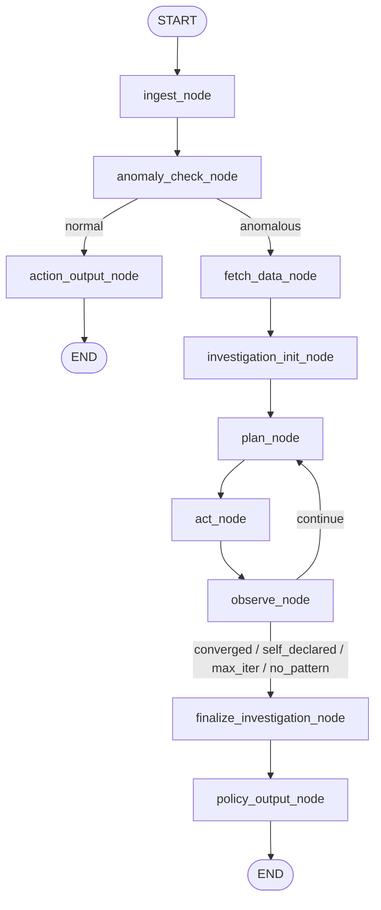

# Fraud Risk Analysis Agent — Workflow

Comprehensive end-to-end workflow of the agent. Generated on 2026-06-14.

---

## 1. Overview

The agent consumes a fraud-ops report (email or post-mortem record), detects
whether the reported fraud constitutes a trend anomaly, runs a deep ReAct
investigation against four MySQL warehouse tables, and emits a detailed
investigation report plus a `RuleJSON` policy suggestion.

- **Architecture:** LangGraph state-machine with a ReAct sub-graph.
- **Data:** MySQL on GreenNode (`trans_log`, `pom_acr`, `user_profile`, `user_journey`).
- **LLMs:** Multi-model routing per node role via `LLM_MODEL_<ROLE>` env vars.
- **Persistence:** LangGraph SqliteSaver / PostgresSaver checkpointer.
- **Output:** structured `investigation_report` + `rule_json` + human-readable `pretty_report` markdown.

---

## 2. High-level topology

### ASCII

```
START → ingest → anomaly_check ──── normal ────→ action_output → END
                       │
                       └── anomalous ─→ fetch_data → investigation_init
                                                          │
                                                          ▼
                                                        plan ◄────┐
                                                          │       │
                                                          ▼       │
                                                         act      │
                                                          │       │
                                                          ▼       │
                                                       observe ───┤  continue
                                                          │       │
                                                          │       │
                          ┌───────────────────────────────┘       │
                          │                                       │
                          ▼ converged / self_declared /           │
                            max_iter / no_pattern                 │
                  finalize_investigation                          │
                          │                                       │
                          ▼                                       │
                   policy_output → END                            │
                                                                  │
                                          (router routes back) ───┘
```

### Mermaid



---

## 3. Phase-by-phase walkthrough

### Phase 1 — Ingest & Triage

#### 3.1.1 `ingest_node`

| Aspect | Detail |
|---|---|
| Role | LLM (`LLM_MODEL_INGEST`) |
| Input | `source_type`, `raw_input` (email body or post-mortem JSON string) |
| Output | `fraud_context` (FraudContext.model_dump) |
| Prompt | 4 sections: ROLE / SCHEMA / RULES / EXAMPLES + 2 few-shot |
| Note | reported_cases mirrors `pom_acr` schema verbatim. No fraud_type enum — raw values preserved. |

Result snippet:
```json
{
  "fraud_context": {
    "reported_cases": [{ "appID": 5210, "transID": "...", "userChargeAmount": 12000000, "bankType": "international", "fraud_type": "CF", ... }],
    "severity": "high",
    "time_hint": "last 90 days",
    "raw_summary": "Chargeback fraud diện rộng trên thẻ quốc tế ..."
  }
}
```

#### 3.1.2 `anomaly_check_node`

| Aspect | Detail |
|---|---|
| Role | LLM (`LLM_MODEL_ANOMALY`) + tools |
| Tool side | `fetch_all_windows(now)` queries pom_acr across **9 comparison windows** |
| Dimensions | `appID, integratedChannel, bankType, bankCode, is_kyc` (configurable via `anomaly_strategy.md` frontmatter) |
| Trigger rules | 20 rules in `anomaly_strategy.md` body: **A1-A7 amount**, **B1-B6 count**, **C1-C7 concentration** |
| LLM output | `AnomalyDecision` — `is_anomalous`, `confidence`, `reasoning`, `evidence: list[{filters, observation}]` |

**9 windows analyzed:**

| Window | Meaning |
|---|---|
| current_week | This week (Mon → today) |
| prev_week | Last week (full 7 days) |
| current_month | Month-to-date |
| prev_month | Previous full month |
| today | D0 |
| yesterday | D-1 |
| rolling_7d | Last 7 days |
| rolling_7d_prev | 7 days before that |
| avg_4w | Average of 4 complete weeks before W0 |

Each window aggregated as `{label, total_amount_vnd, total_count, by_<dim>: [...]}`.

**Routing edge:** `anomaly_route(state) → "anomalous" | "normal"`

#### 3.1.3 `action_output_node` (terminal — `normal` branch)

| Aspect | Detail |
|---|---|
| Role | Tool-only (no LLM) |
| Output | `NoActionReport` (decision + baseline window + 2 summaries + recommendation), `notify_strategist(...)`, `pretty_report` (markdown) |
| Edge | → END |

---

### Phase 2 — Targeted Retrieval

#### 3.2.1 `fetch_data_node`

| Aspect | Detail |
|---|---|
| Role | Tool-only (no LLM) |
| Input | `anomaly_decision.evidence: list[{filters, observation}]` |
| Tool calls per evidence | `query_with_filters("pom_acr", filters, window)` + `query_with_filters("trans_log", filters, window)` |
| Window | `compute_investigation_window(now)` = `[first_day_of_prev_month, today]` |
| Sample size | From `fetch_strategy.md` frontmatter `sample_size: 20` |
| Schema fetch | `get_schema(["trans_log", "pom_acr", "user_profile", "user_journey"])` |
| State added | `investigation_window`, `investigation_slices`, `fetch_strategy_body`, `data_schema` |

`investigation_slices` shape:
```json
{
  "bankType=international": {
    "filters": {"bankType": "international"},
    "observation": "reported 100% international vs baseline ~45%",
    "pom":   {"count": 294, "sample_rows": [<20 rows>]},
    "trans": {"count": 1908, "sample_rows": [<20 rows>]}
  },
  ...
}
```

---

### Phase 3 — Agentic Investigation (ReAct Sub-graph)

#### 3.3.1 `investigation_init_node`

| Aspect | Detail |
|---|---|
| Role | Tool-only |
| Loads | `investigation_kb.md` (catalog + thresholds + rule templates) and `investigation_skill.md` (procedural + meta-principles + worked example) |
| State init | `investigation_iteration=0`, `investigation_log=[]`, `patterns_attempted=[]`, `current_hypothesis=None`, `investigation_stop_reason=None` |

#### 3.3.2 `plan_node` (LLM)

| Aspect | Detail |
|---|---|
| Role | LLM (`LLM_MODEL_PLAN` — recommend `minimax/minimax-m2.5` or similar reasoning model) |
| Prompt sections | ROLE + KB body + SKILL body + TOOL_REGISTRY_SPEC + OUTPUT_SCHEMA |
| User payload | iteration N + anomaly_summary + investigation_slices_overview + data_schema columns + threshold_target + last 3 log entries + top 8 patterns by F1 |
| Output | `current_step` dict — `{iteration, plan_thought, tool, args, hypothesis_being_tested}` |

#### 3.3.3 `act_node`

| Aspect | Detail |
|---|---|
| Role | Tool dispatcher (no LLM) |
| Lookup | `TOOL_REGISTRY[step.tool](**step.args)` |
| Error handling | `TypeError`, generic `Exception` → `observation = {"error": "<msg>"}` |
| Cap | `sample_rows` capped to 15 even if tool returned more |

#### 3.3.4 `observe_node` (LLM + 3-layer defense)

| Aspect | Detail |
|---|---|
| Role | LLM (`LLM_MODEL_OBSERVE`) |
| Prompt sections | ROLE + KB + SKILL + OUTPUT_SCHEMA |
| User payload | iteration step (plan_thought / args / observation) + threshold_target + patterns_attempted_so_far |
| LLM output | `{next_thought, updated_hypothesis, new_pattern_attempt, stop}` |

**3-layer defense applied to `new_pattern_attempt`:**

| Layer | Mechanism | Handles |
|---|---|---|
| **L1 — Prompt schema** | Explicit "MUST copy metrics verbatim, MUST not set null" in schema doc | LLM is more likely to comply |
| **L2 — Defensive metric fill** | If LLM returned dict but `metrics` is null AND tool was `compute_metrics` AND observation has `precision` → auto-copy fields from observation | LLM recorded pattern but dropped metric values |
| **L3 — Auto-record fallback** | If LLM returned `new_pattern_attempt=null` AND tool was `compute_metrics` AND observation succeeded → synthesize PatternAttempt from observation | LLM forgot to record at all |

After defense layers, status is **always** recomputed deterministically via `_classify_status(metrics, threshold_config)` — never trusts LLM-set status.

```python
def _classify_status(metrics, cfg):
    if not metrics: return "candidate"
    p, r = metrics["precision"], metrics["recall"]
    if p >= cfg["min_precision"] and r >= cfg["min_recall"]: return "passed"
    if p < 0.7 and r < 0.2: return "failed"
    return "candidate"
```

#### 3.3.5 `investigation_route` (conditional edge)

```python
def investigation_route(state):
    best = _best_qualified(patterns, cfg)   # actual metric vs threshold
    
    if best:
        if best.metrics.precision >= 0.95 (SHORTCIRCUIT_PRECISION):
            return "converged"
        if len(sources_explored(patterns)) >= 2:   # KB §1 escalation
            return "converged"
    
    if stop_reason == "self_declared":
        return "self_declared" if best else "no_pattern"
    
    if iteration >= max_iterations:
        return "max_iter" if patterns else "no_pattern"
    
    return "continue"
```

Routes back to `plan` (continue) or forward to `finalize_investigation`.

#### 3.3.6 `finalize_investigation_node`

| Aspect | Detail |
|---|---|
| Role | Tool-only (no LLM) |
| Picks | `final_pattern` = highest F1 among `passed`-status patterns (fallback: highest F1 among scored patterns) — patterns with no metrics are excluded |
| Builds | `InvestigationReport` (patterns_attempted, final_pattern, stop_reason, iteration_count, investigation_log, recommendation) |
| Also fills | legacy `final_report` (back-compat for downstream code) |

---

### Phase 4 — Policy Output

#### 3.4.1 `policy_output_node`

| Aspect | Detail |
|---|---|
| Role | Tool-only |
| Builds | `RuleJSON` from `final_pattern` |
| Status | `"suggested"` if pattern exists, `"no_action"` otherwise |
| Action | Copied from `final_pattern.recommended_action` (`monitor` / `challenge` / `reject` / `blacklist` / `whitelist_exclusion`) |
| Also builds | `pretty_report` (markdown) covering anomaly + ReAct trace + patterns + final pattern + rule_json |

---

## 4. State lifecycle

| Phase | State keys produced |
|---|---|
| ingest | `fraud_context` |
| anomaly_check | `baseline_window`, `baseline_summary`, `reported_summary`, `anomaly_decision` |
| ↳ normal branch | `no_action_report`, `pretty_report` → END |
| fetch_data | `investigation_window`, `investigation_slices`, `fetch_strategy_body`, `data_schema` |
| investigation_init | `investigation_kb_body`, `investigation_skill_body`, `investigation_iteration=0`, `investigation_log=[]`, `patterns_attempted=[]` |
| plan | `current_step` (in flight) |
| act | `current_step.observation` |
| observe | `investigation_log` append, `patterns_attempted` extend, iteration++ |
| (loop) | … |
| finalize | `investigation_report`, `final_report`, `investigation_stop_reason` |
| policy_output | `rule_json`, `pretty_report` |

All persisted by LangGraph checkpointer at every step — full audit / replay.

---

## 5. Tool registry (LLM-facing)

Defined in `app/tools/investigation_tools.py`. Each takes primitive args and returns JSON-serializable dicts.

| Tool | Args | Returns |
|---|---|---|
| `query_with_filters` | `table`, `filters?`, `window?`, `limit?` | `{count, sample_rows (≤15)}` |
| `aggregate` | `table`, `dimensions`, `filters?`, `window?` | `{total_count, total_amount_vnd?, by_<dim>: [...]}` |
| `compute_metrics` | `sql_predicate` (must return `transID`), `window?`, `fraud_types?` | `{precision, recall, f1, hit_count, total_fraud, total_flagged}` |
| `raw_sql` | `sql` (SELECT only) | `{columns, row_count, rows_sample (≤15)}` |

**Time column per table** (used when `window` is given):

| Table | Time column |
|---|---|
| `trans_log` | `reqDate` |
| `pom_acr` | `reqDate` |
| `user_journey` | `event_time` |
| `user_profile` | `account_created_date` |

SQL safety: every `compute_metrics.sql_predicate` and `raw_sql.sql` passes through `validate_sql()` which blocks `INSERT / UPDATE / DELETE / DROP / ALTER / TRUNCATE / CREATE / MERGE / GRANT / REVOKE` and multi-statement payloads.

---

## 6. Data sources (MySQL on GreenNode)

### 6.1 `trans_log` (universe — all transactions)

Columns: `transID (PK)`, `appID`, `userID`, `reqDate`, `transStatus`, `userChargeAmount`, `source`, `integratedChannel`, `is_kyc`, `transType`, `map_type`, `bankconnectorcode`, `bankCode`, `pmcID`, `paymentSolution`, `month`, `week`, `bankType`, `appName`, `reportCat`, `appID_appName`.

### 6.2 `pom_acr` (confirmed-fraud subset)

= `trans_log` columns + `fraud_type`, `report_date`, `is_loss`.

### 6.3 `user_profile` (identity + KYC + trust)

`userID (PK)`, `account_created_date`, `ekyc_status`, `ekyc_date`, `nfc_status`, `nfc_date`, `dob_year`, `phone`, `cccd_hash`, `linked_bank`, `linked_card`, `has_credit_limit`, `has_mmf`, `trusted_user`, `whitelist`, `blacklist`, `historical_fraud`.

### 6.4 `user_journey` (pre-transaction events)

`event_id (PK auto)`, `userID`, `event_type`, `event_time`.

Event types: `register`, `login`, `login_new_device`, `change_phone`, `reset_pin`, `map_bank`, `unmap_bank`, `eKYC`, `NFC`, `change_device`, `lock_account`, `unlock_account`, `map_card`, `unmap_card`.

---

## 7. Strategy files (markdown-driven config)

| File | Read by | Frontmatter | Body purpose |
|---|---|---|---|
| `app/nodes/anomaly_strategy.md` | `anomaly_check_node` | `dimensions: [appID, integratedChannel, bankType, bankCode, is_kyc]` | Triggers A/B/C + dimension→schema mapping + confidence guidance |
| `app/nodes/fetch_strategy.md` | `fetch_data_node` | `sample_size: 20` | Pattern-finding hints (stored in `fetch_strategy_body`) |
| `app/nodes/investigation_kb.md` | `investigation_init_node` (inj into plan / observe prompts) | — | Catalog of metrics + thresholds + rule templates + acceptance criteria + action mapping + output schema |
| `app/nodes/investigation_skill.md` | `investigation_init_node` (inj into plan / observe prompts) | — | Master thinking flow + escalation order + hard rules + worked example + ReAct discipline |

All editable without code changes — agent re-loads strategy text on every run.

---

## 8. Model routing

Per-node model selection via env vars. Fallback to `LLM_MODEL` if `LLM_MODEL_<ROLE>` unset.

| Role | Default env var | Suggested model |
|---|---|---|
| ingest | `LLM_MODEL_INGEST` | `qwen/qwen3-5-27b` |
| anomaly | `LLM_MODEL_ANOMALY` | `qwen/qwen3.7-plus` |
| plan | `LLM_MODEL_PLAN` | `minimax/minimax-m2.5` |
| observe | `LLM_MODEL_OBSERVE` | `minimax/minimax-m2.5` |
| (fallback) | `LLM_MODEL` | `google/gemma-4-31b-it` |

Code: `get_llm(role="plan", thinking=True)` → `OpenAILLM(model=_resolve_model("plan"))`.

---

## 9. Defense layers (LLM reliability)

Multi-layer guard against LLM unreliability around structured output:

| Failure mode | Defense |
|---|---|
| LLM marks borderline rule `status="passed"` | `_classify_status(metrics, threshold)` always overrides — pure function of metrics |
| LLM records `new_pattern_attempt` but with `metrics: null` | Layer 2 — auto-copy from `step.observation` when `tool=compute_metrics` |
| LLM forgets to record `new_pattern_attempt` at all | Layer 3 — synthesize PatternAttempt from `step.observation` when `tool=compute_metrics` succeeded |
| LLM stops too early at translog-only rule | `investigation_route` requires precision ≥ 0.95 (shortcircuit) OR ≥ 2 data sources tried before allowing `converged` |
| LLM picks non-qualifying rule as final | `finalize_investigation._pick_final` excludes patterns with `f1=0`; prefers `passed` over `candidate` |
| LLM generates write SQL | `validate_sql()` rejects any non-SELECT |
| Tool errors crash the run | `act_node` wraps tool calls; errors land as `observation={"error": ...}` so observe_node can recover |

---

## 10. End-to-end example trace

Below: a real run with the planted CF scenario (50 fraud users on international card with map_card abuse). max_iterations=12, thresholds P≥0.90 R≥0.20.

| T (s) | Node | Outcome |
|---|---|---|
| 0 | START | run_id=`a1f2f667` |
| 46 | ingest | fraud_context.reported_cases parsed (4 cases CF/international) |
| 127 | anomaly_check | `is_anomalous=True conf=0.95`, 5 evidence entries (bankCode=ZPCC dominant, channel=CREDIT CARD dominant) |
| 130 | fetch_data | 3 investigation_slices, window `2026-05-01 → 2026-06-13` |
| 130 | investigation_init | KB + skill loaded |
| 154 | plan #1 | `aggregate` (pom_acr by bankType) |
| 154 | act #1 | total=521 |
| 162 | observe #1 | exploration |
| 198 | plan #2 | `compute_metrics` (`bankType=intl AND amount>=5M`) |
| 225 | act #2 | **P=0.52 R=0.91 F1=0.66** |
| 231 | observe #2 | pattern recorded (candidate, fail precision); Layer-2 metric fill if needed |
| 240 | plan #3 | `compute_metrics` (+ JOIN user_profile + account_age≤7d) |
| 267 | act #3 | **P=0.91 R=0.88 F1=0.89** |
| 276 | observe #3 | pattern recorded (passed); `stop=true` |
| 276 | investigation_route | `self_declared` (best precision≥0.9 AND recall≥0.2) |
| 276 | finalize_investigation | final_pattern = Layer-2 rule |
| 276 | policy_output | RuleJSON status=`suggested`, action=`reject`; pretty_report rendered |
| 276 | END | |

Total: ~4.5 minutes. 2 compute_metrics calls, 2 patterns recorded, 1 passed → converged.

---

## 11. Output schemas

### 11.1 `InvestigationReport` (canonical, in state)

```python
class InvestigationReport(BaseModel):
    patterns_attempted: list[PatternAttempt]
    final_pattern: Optional[PatternAttempt]
    stop_reason: Literal["converged", "max_iter", "no_pattern", "self_declared", "error"]
    iteration_count: int
    investigation_log: list[InvestigationStep]
    recommendation: str
```

`PatternAttempt`:
```python
class PatternAttempt(BaseModel):
    iteration: int
    description: str
    sql_predicate: str
    signal_columns: list[str]
    rationale: str
    metrics: Optional[MetricsResult]
    recommended_action: Literal["monitor","challenge","reject","blacklist","whitelist_exclusion","none"]
    status: Literal["candidate","passed","failed","abandoned"]
    notes: str
```

`InvestigationStep`:
```python
class InvestigationStep(BaseModel):
    iteration: int
    plan_thought: str
    tool: str
    args: dict
    hypothesis_being_tested: Optional[str]
    observation: dict
    next_thought: str
```

### 11.2 `RuleJSON` (handoff contract to Config Agent)

```python
class RuleJSON(BaseModel):
    rule_name: str
    fraud_type: str
    sql_predicate: str
    description: str
    signal_columns: list[str]
    recommended_action: Literal[...]
    metrics: RuleJSONMetrics    # precision / recall / f1
    iteration_count: int
    status: Literal["suggested", "no_action"]
    emitted_at: str  # ISO 8601 UTC
    source_run_id: Optional[str]
```

### 11.3 `pretty_report` (markdown — UI + human consumption)

Sections (built by `app/nodes/_pretty_report.py`):
1. Header (run_id, source, emitted_at)
2. Anomaly check (decision, confidence, reasoning, evidence table)
3. Investigation overview (stop_reason, iterations, recommendation)
4. ReAct trace (per-iteration: plan, hypothesis, args, observation summary, next_thought)
5. Patterns attempted (table P/R/F1/action)
6. Final pattern (description, SQL, metrics, rationale)
7. Policy suggestion (RuleJSON summary + raw JSON)

The same renderer also produces a short version for the no-anomaly path.

---

## 12. Env config

```bash
# LLM
LLM_API_KEY=...
LLM_BASE_URL=https://maas-llm-aiplatform-hcm.api.vngcloud.vn/v1
LLM_MODEL=google/gemma-4-31b-it       # global fallback

LLM_MODEL_INGEST=qwen/qwen3-5-27b
LLM_MODEL_ANOMALY=qwen/qwen3.7-plus
LLM_MODEL_PLAN=minimax/minimax-m2.5
LLM_MODEL_OBSERVE=minimax/minimax-m2.5

# MySQL warehouse
MYSQL_HOST=49.213.71.37
MYSQL_PORT=3306
MYSQL_DB=risk_db
MYSQL_USER=root
MYSQL_PASSWORD=...

# Runtime
CHECKPOINTER_BACKEND=sqlite           # memory | sqlite | postgres
SQLITE_CHECKPOINT_PATH=checkpoints.db
BASELINE_DAYS=7                       # anomaly_check baseline window
GROUND_TRUTH_SOURCE=pom_acr           # pom_acr | column
WAREHOUSE_BACKEND=mysql               # mysql | warehouse
```

---

## 13. Service surface

FastAPI service (`app/service.py`):

| Method | Endpoint | Purpose |
|---|---|---|
| POST | `/runs` | Create run with email/postmortem raw_input + threshold config |
| GET | `/runs/{run_id}` | Poll status + full state (anomaly_decision, investigation_report, no_action_report, rule_json, pretty_report) |
| GET | `/runs` | List run_ids |
| POST | `/triggers/email` | Email-listener webhook (subject/sender/body → normalize) |
| POST | `/triggers/postmortem` | Post-mortem DB event webhook (incident_id/summary/record JSON) |
| GET | `/health` | Health probe |

`RunStatus`: `running | completed | failed`. No human review gate.

Streamlit viewer (`review_ui.py`): read-only, lists runs, shows anomaly decision, investigation report, all attempts, ReAct trace, RuleJSON.

---

## 14. Run cost characterization

Approximate per-run cost (multi-model setup, ~10K-iter prompt size):

| Phase | LLM calls | Time (s) |
|---|---|---|
| ingest | 1 | 5-50 |
| anomaly_check | 1 | 15-130 |
| fetch_data | 0 | 1-2 |
| investigation (4-12 iter × 2 LLM calls per iter) | 8-24 | 60-300 |
| finalize + policy_output | 0 | ~0 |
| **Total** | **10-30 LLM calls** | **~60-500s** |

Most cost is in the ReAct loop. Reducing `max_iterations` cuts cost linearly.

---

## 15. Code layout

```
fraud-analysis-agent/
  app/
    state.py                          # all Pydantic models + AgentState TypedDict
    main.py                           # CLI entry
    service.py                        # FastAPI
    contracts/rulejson.py             # RuleJSON contract
    data/
      mock_data.py                    # generate() for 4 tables (testing)
      seed_mysql.py                   # seed MySQL with mock data
    llm/
      __init__.py
      base.py                         # OpenAILLM + get_llm(role=...)
    tools/
      sql_safety.py                   # validate_sql
      warehouse.py                    # MySQL via SQLAlchemy
      time_window.py                  # resolve_time_window, investigation_window
      baseline.py                     # 9-window queries for anomaly_check
      historical.py                   # query_pom_acr, query_with_filters, aggregate_by, count_by, aggregate_pom_acr
      universe.py                     # trans_log baseline
      schema.py                       # get_schema (DESCRIBE)
      metrics.py                      # compute_metrics
      notify.py                       # notify_strategist
      investigation_tools.py          # TOOL_REGISTRY for the ReAct loop
    nodes/
      ingest.py
      anomaly_check.py
      anomaly_strategy.md             # editable
      action_output.py
      fetch_data.py
      fetch_strategy.md               # editable
      investigation_init.py
      investigation_kb.md             # editable (KB Part 2)
      investigation_skill.md          # editable (procedural + worked example)
      plan.py
      act.py
      observe.py                      # 3-layer defense
      investigation_router.py
      finalize_investigation.py
      policy_output.py
      _pretty_report.py               # markdown renderer
    graph/__init__.py                 # wire StateGraph + checkpointer
  scripts/
    e2e_test.py                       # single scenario end-to-end
    test_scenarios.py                 # 3 scenarios (strict / permissive / postmortem)
  review_ui.py                        # Streamlit viewer
  pyproject.toml
docs/
  AGENT_WORKFLOW.md                   # THIS FILE
  Fraud_Analysis_Knowledge.md         # original KB doc
  ai-agents-risk-team-doc.docx        # team doc
.env                                  # local secrets (gitignored)
docker-compose.yml
```

---

## 16. Quick reference

**Run end-to-end CLI:**
```bash
cd fraud-analysis-agent
set -a && source ../.env && set +a
CHECKPOINTER_BACKEND=memory PYTHONPATH=. uv run python scripts/e2e_test.py
```

**Start service + UI:**
```bash
cd fraud-analysis-agent
set -a && source ../.env && set +a
CHECKPOINTER_BACKEND=sqlite PYTHONPATH=. uv run uvicorn app.service:app --port 8000 &
AGENT_URL=http://localhost:8000 uv run streamlit run review_ui.py --server.port 8501 &
# Then open http://localhost:8501
```

**Seed MySQL (destructive — re-creates tables):**
```bash
cd fraud-analysis-agent
set -a && source ../.env && set +a
uv run python -m app.data.seed_mysql
```

**Tune behavior without code changes:**
- Adjust trigger rules → edit `app/nodes/anomaly_strategy.md`
- Adjust KB lookup tables → edit `app/nodes/investigation_kb.md`
- Adjust skill / heuristics → edit `app/nodes/investigation_skill.md`
- Adjust models → set `LLM_MODEL_<ROLE>` env vars
- Adjust thresholds → request payload `min_precision`, `min_recall`, `max_iterations`
